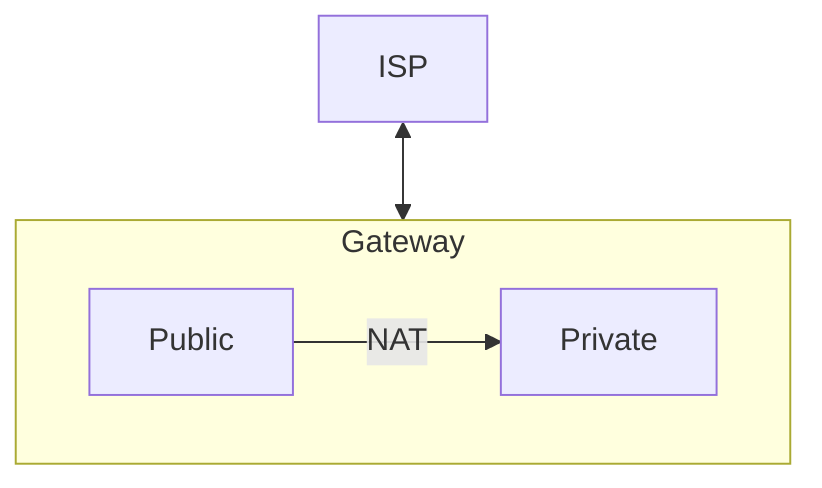
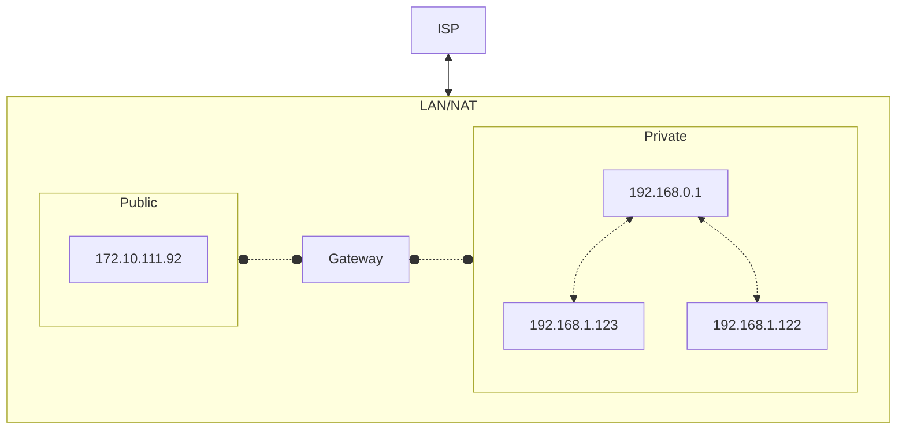
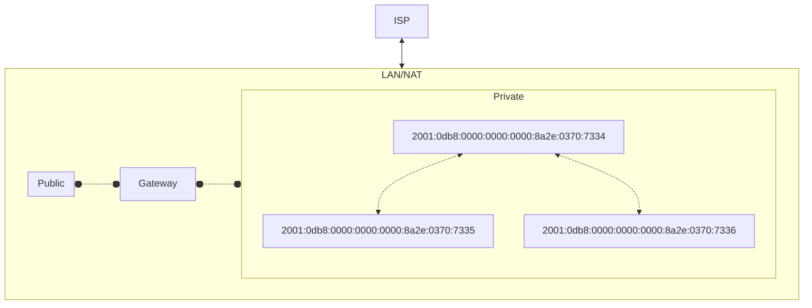
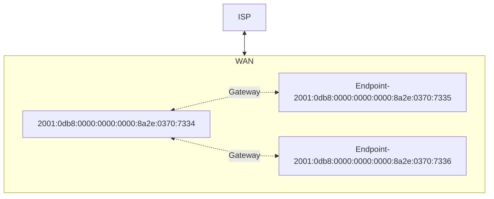

# About me
---
layout: cover
background: text-center
highlighter: shikiji
transition: slide-left
title: IPV6
mdc: true
---
🚀 ☠️  🎮 "(1983) War Games - Starring Matthew Broderick: A young man finds a back door into a military central computer in which reality is confused with game-playing, possibly starting World War III."
---
layout: default
---
## Overview:
- What is an IP Address?
  - What necessitates a version 6? What happened to version 5?
- What benefits does IPV6 offer over IPV4?
- Looking to the future
  - What can we expect the next 10 years to look like?

<footer class="absolute bottom-0 left-0 right-0 p-2">
{{ $nav.currentPage }} / {{ $nav.total }}
</footer>
---
mdc: true
---
# [Review] What is an IP Address?
> IP Address are a digital representation of an network address used for host identification.
> An address consists of four of 4 sets of octets* or bytes. Each octect is 3 commonly represented as 1-3 digits.

</br>
</br>

For example:
```sh
185.107.800.231 #<-- IP address represented in digits
10111001 01101011 01010000 11100111 # <-- Represented in binary octet sets
```
<footer class="absolute bottom-0 left-0 right-0 p-2">
{{ $nav.currentPage }} / {{ $nav.total }}
</footer>
---
mdc: true
---
# IPV4 Maths
>An octet has a highest possible value of 255 (i.e. 11111111).
>This is to say 0-255 (256) possible digits per octet.

$1byte=8bits$

$4bytes=(8*4)=32bits$

$256*256*256*256=256^4=2^{32}=4294967296\ possible\ values$

*This number is simply not high enough for each device to be assigned an address.*

## Result: We need another solution

<footer class="absolute bottom-0 left-0 right-0 p-2">
{{ $nav.currentPage }} / {{ $nav.total }}
</footer>

---
layout: default
mdc: true
---
# NAT (Network Address Translation)
> IP Addresses are translated between public and private, s.t. each home, business, etc. has their own router which knows how to route calls internally to devices.



---
layout: center
mdc: true
---



<footer class="absolute bottom-0 left-0 right-0 p-2">
{{ $nav.currentPage }} / {{ $nav.total }}
</footer>

---
layout: iframe-right
url: https://cidr.xyz/
---

# What is a CIDR?
> A CIDR is a classification of network. Defined as "Classless Inter Domain Routing",
it is a way of allocating IP addresses into subnets.


**see to [aws - what is a cidr](https://aws.amazon.com/what-is/cidr/) for more info**

<footer class="absolute bottom-0 left-0 right-0 p-2">
{{ $nav.currentPage }} / {{ $nav.total }}
</footer>

---
layout: center
---
# IPV6: *the future has arrived*
<footer class="absolute bottom-0 left-0 right-0 p-2">
{{ $nav.currentPage }} / {{ $nav.total }}
</footer>

---
layout: default
---

> Why IPV6?

  We're out of IP Address space

> What is it?

  Eight groups of hexadecimal digits (or 128 bits / 16 bytes)

> What about IPV5?

  Intended for streams, it had a 32 bit limitation and was thus never officially adopted.

  (See [IEN 119](https://www.rfc-editor.org/ien/ien119.txt))

---
layout: default
mdc: true
---

### Example.

```sh
2001:0db8:0000:0000:0000:8a2e:0370:7334
```

$4*8=128\ bits = 16\ bytes$

$4^8=2^{128}= ~340\ undecillion\ possible\ addresses$


**see [RFC 2460](https://www.rfc-editor.org/rfc/rfc2460) for further details
<footer class="absolute bottom-0 left-0 right-0 p-2">
{{ $nav.currentPage }} / {{ $nav.total }}
</footer>

---
layout: default
mdc: default
---
# What does this mean?
* ~~NAT~~
  * Instead there are enough numbers for every device to be assigned a public IP address.
* We will still want to/need to rely on common firewall protections to avoid security breaches.
* Windows CVE vulnerability likely tied to NAT/IPV6 issue
* Larger extension headers

<footer class="absolute bottom-0 left-0 right-0 p-2">
{{ $nav.currentPage }} / {{ $nav.total }}
</footer>

---
layout: default
---
# Cont.
* Cloud IP allocation costs decrease because of higher supply of IP Addresses.
* SLAAC (Stateless Address Autoconfiguration)
* Multicasting
* Router performance increase

<footer class="absolute bottom-0 left-0 right-0 p-2">
{{ $nav.currentPage }} / {{ $nav.total }}
</footer>

---
layout: full
mdc: true
drawings:
  enabled: true
---



<footer class="absolute bottom-0 left-0 right-0 p-2">
{{ $nav.currentPage }} / {{ $nav.total }}
</footer>

---
layout: full
mdc: true
drawings:
  enabled: true
---



<footer class="absolute bottom-0 left-0 right-0 p-2">
{{ $nav.currentPage }} / {{ $nav.total }}
</footer>


---
layout: end
---
# Thank you!
