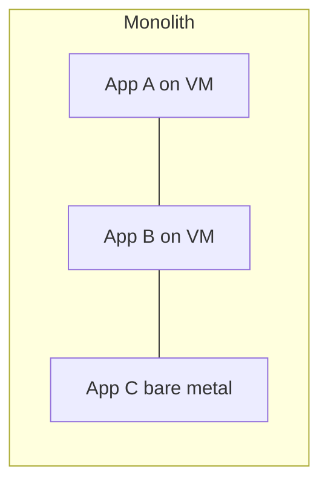
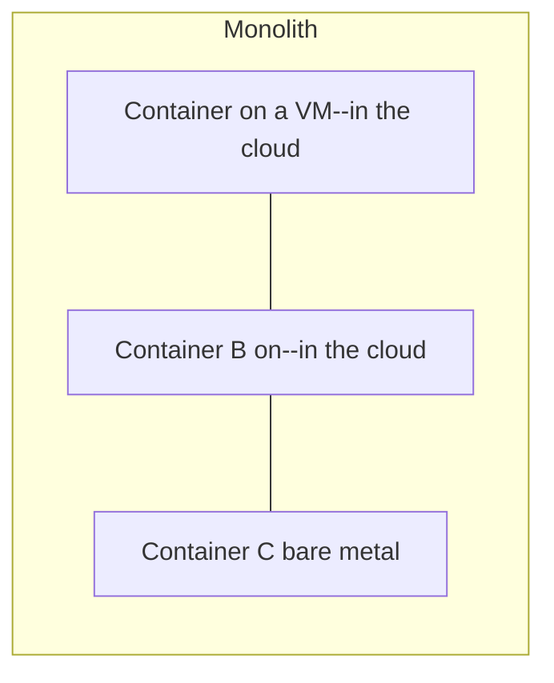
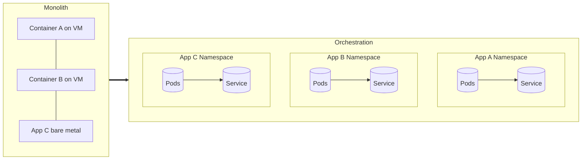

# Why Kubernetes, Why Now?
<!--<div class="badge">Why Kubernetes is OITs chosen deployment method</div>-->
Why Kubernetes is OIT's chosen deployment method
<!--
Speaker notes:
- Strategic lens for a developer audience
- Flow: challenges → K8s benefits → timing → pitfalls → mitigations
-->

---
layout: intro
---

## Ground Rules
<v-clicks>

- James 1:22
- Technology is just as much a process as it is a function/resource
- "Sage on the stage" is the [weakest form of instruction](https://www.science.org/content/article/lectures-arent-just-boring-theyre-ineffective-too-study-finds)--if you have questions, ask them.

</v-clicks>
<!--
Speaker Notes:
- Be ye doers of the word and not hearers only--I believe in working to understand so I'm going to do my best to give you time back at the end of the presentation to let you run the laps.
- This is to say
-->

<div class="absolute left-30px bottom-30px">
  <SlideCurrentNo /> / <SlidesTotal />
</div>
---
layout: center
---

## ABOUT ME
```shell
➜ ~/docs/presentations/why-k8s $ finger rbulkley
Login: rbulkley                         Name: Rhett Bulkley
Directory: /Users/rbulkley              Shell: /bin/zsh
Department: OIT                         Role: Site Reliability Engineer
Editor: VIM                             Other: Father of 3 | Avid Rock Climber
On since Mon Dec  31 00:01 (MDT) on console,       idle 0:01 (messages off)
On since Mon Oct  31 14:39 (MDT) on ttys000,       idle 0:01
```
---

## Deployment Methods at BYU over the years

---
layout: center
---



---
layout: center
---

# Move to the Cloud

<!--Then came to edict: move to the cloud-->

---
layout: fact
---

## Containerization

A unit of software delivery with a well-defined boundary
allowing for ease-of-deployment across different environments
with minimal setup

<!--But in order to move to the cloud you'll probably benefit from some other methodologies-->
---
layout: center
---




---
layout: center
---
Side effect:
Developer-strain

---
layout: fact
---

## Orchestration
Deploying sets of containerized workloads in a cloud native
pattern

---
layout: full
---




<!--
20 yours ago, there was a strong operations culture:
Developers pushed code
https://github.com/awslabs/amazon-ecs-nodejs-microservices/blob/master/2-containerized/deploy.sh

As campus grew and developed greater needs for diverse application sets, as well as mutliple-masters started joining the fray: the need for a new solution became evident.
That transitioned to AWS deployments (to accomodate the greater flexibility of the container).
However that also shifted the deployment infrastructure expertise to the developer causing overload.

Now we're seeing ways to reduce that overhead without compromising the infrastructure (in a more cloud native format, but on-prem).
-->

---

## The Debate
_Do you even need Kubernetes?_

- “Most orgs don’t—use a monolith.” **Context matters.**
- Our reality: many apps, many owners, seasonal spikes

<!--
Speaker notes:
Acknowledge monolith virtues; our constraints make K8s pragmatic.
-->

<div class="absolute left-30px bottom-30px">
  <SlideCurrentNo /> / <SlidesTotal />
</div>
---
layout: two-cols-header
---

## The University Landscape

::left::

## Constraints
<v-clicks>

- Organizational Priorities
- Different stacks, owners, SLAs
- Security/compliance requirements
- Seasonal burst traffic (registration, admissions)

</v-clicks>

::right::
## Tools
<v-clicks>

- Admissions     → PHP / MySQL
- Student Portal → C / Oracle
- Research Apps  → Python / GPU
- Admin Tools    → NodeJS / Postgres

</v-clicks>
<!-- notes: Paint heterogeneity + political decentralization. -->
<!--<style>-->
<!--.two-cols-header {-->
<!--  column-gap: 20px; /* Adjust the gap size as needed */-->
<!--}-->
<!--</style>-->

<div class="absolute left-30px bottom-30px">
  <SlideCurrentNo /> / <SlidesTotal />
</div>

---

## Pain Points

- Manual scaling, weekend fire-fights
- Snowflake servers, drift
- Duplicated infra, inconsistent releases
- Limited self-service for teams
<div class="absolute left-30px bottom-30px">
  <SlideCurrentNo /> / <SlidesTotal />
</div>

---

## What Kubernetes Brings

- **Portability**: on-prem, cloud, hybrid
- **Elasticity**: horizontal autoscaling, self-healing pods
- **Multi-tenancy**: namespaces, quotas, RBAC
- **Consistency**: declarative configs, GitOps
- **Ecosystem**: ingress, service mesh, observability

<!-- notes: Stress governance + guardrails, not just features. -->

<div class="absolute left-30px bottom-30px">
  <SlideCurrentNo /> / <SlidesTotal />
</div>
---

## Why Now?

- Ecosystem maturity (operators, tooling, docs)
- Internal readiness (DevOps skills, CI/CD, Site Reliability Team)
- Demand for developer time

<div class="absolute left-30px bottom-30px">
  <SlideCurrentNo /> / <SlidesTotal />
</div>
---
layout: two-cols-header
---

## Addressing the Critics

::left::

### Monolith World
- Single product, single team
- Rapid iteration
- Lower ops overhead

::right::

### Our World
- Dozens of apps, many stakeholders
- Heterogeneous tech + SLAs
- Spiky workloads, shared infra

<div class="absolute left-30px bottom-30px">
  <SlideCurrentNo /> / <SlidesTotal />
</div>
---
layout: cover
---

## Conclusion
<v-click>K8s fits our constraints.</v-click>

<div class="absolute left-30px bottom-30px">
 <SlideCurrentNo /> / <SlidesTotal />
</div>
---

## Pitfalls to Avoid

- Adopting “because everyone else is”
- Underestimating skills & culture change
- Treating clusters as “set and forget”
- Hidden costs: networking, observability, upgrades

<div class="absolute left-30px bottom-30px">
 <SlideCurrentNo /> / <SlidesTotal />
</div>
---

## Mitigations (Our Guardrails)

- Phased rollout: pilot → limited prod → scale
- Golden templates (Deployments, Ingress, HPA)
- Policy & governance: RBAC, quotas, network policies
- SRE basics: SLOs, error budgets, on-call
- Measure outcomes: lead time, MTTR, availability, cost/CPU

<div class="absolute left-30px bottom-30px">
 <SlideCurrentNo /> / <SlidesTotal />
</div>
---

## Takeaways

- Kubernetes ≠ default; **context decides**
- For our university: **flexibility, scale, resilience**
- Success = platform + governance + culture

**Links: This is the learn-by-doing part**
- [minikube](https://minikube.sigs.k8s.io/docs/)
- [kind](https://kind.sigs.k8s.io/docs/user/local-registry/)
- [k3s](https://k3s.io/)
** Slides / Contact Info **
- [slides](https://github.com/rhettjay/presentations/why-k8s)
- [Find me on GitHub - @rhettjay](https://github.com/rhettjay)
- [contact: rbulkley@byu.edu](mailt:rbulkley@byu.edu)

<div class="absolute left-30px bottom-30px">
 <SlideCurrentNo /> / <SlidesTotal />
</div>
---

## Demo · What You'll See

- Dashboard shows:
  - **Pod instanceId**, **version-update**
  - **Self-healing** button to demo self-healing
- On-stage flows:
  1) Self-heal → pod disappears then reappears
  2) Blue/Green → version swap

---

## Demo App (Overview)

```text
k8s-demo/
├─ server.js            # Node/Express app with /info, /crash, /healthz
├─ public/index.html    # Dashboard UI (sampler + controls)
├─ package.json
├─ Dockerfile
└─ k8s/
   ├─ deploy-v1.yaml
   ├─ deploy-v2.yaml
   ├─ service.yaml
   ├─ hpa.yaml
   └─ ingress.yaml
```
- **v1** and **v2** differ by `APP_VERSION` and accent color (blue/green)
- **Service** routes to `track=active` (flip labels for cutover)

---

## Demo Templates · Deployment v1

```yaml
apiVersion: apps/v1
kind: Deployment
metadata:
  name: demo-v1
spec:
  replicas: 2
  selector:
    matchLabels:
      app: k8s-demo
      version: v1
  template:
    metadata:
      labels:
        app: k8s-demo
        version: v1
        track: active
    spec:
      containers:
      - name: app
        image: YOUR_REGISTRY/k8s-demo:v1
        ports:
        - containerPort: 8080
        env:
        - name: APP_VERSION
          value: "v1"
        - name: APP_ACCENT
          value: "#2DD4BF"
        - name: BRAND_NAVY
          value: "#002E5D"
        - name: BRAND_WHITE
          value: "#FFFFFF"
        readinessProbe:
          httpGet: { path: /healthz, port: 8080 }
          periodSeconds: 3
        livenessProbe:
          httpGet: { path: /healthz, port: 8080 }
          initialDelaySeconds: 5
```

---

## Demo Templates · Deployment v2

```yaml
apiVersion: apps/v1
kind: Deployment
metadata:
  name: demo-v2
spec:
  replicas: 2
  selector:
    matchLabels:
      app: k8s-demo
      version: v2
  template:
    metadata:
      labels:
        app: k8s-demo
        version: v2
        track: preview
    spec:
      containers:
      - name: app
        image: YOUR_REGISTRY/k8s-demo:v1
        ports:
        - containerPort: 8080
        env:
        - name: APP_VERSION
          value: "v2"
        - name: APP_ACCENT
          value: "#A78BFA"
        - name: BRAND_NAVY
          value: "#002E5D"
        - name: BRAND_WHITE
          value: "#FFFFFF"
        readinessProbe:
          httpGet: { path: /healthz, port: 8080 }
          periodSeconds: 3
        livenessProbe:
          httpGet: { path: /healthz, port: 8080 }
          initialDelaySeconds: 5
```

---

## Demo Templates · Service & HPA

```yaml
apiVersion: v1
kind: Service
metadata:
  name: demo-svc
spec:
  selector:
    app: k8s-demo
    track: active
  ports:
  - name: http
    port: 80
    targetPort: 8080
  type: LoadBalancer
---
apiVersion: autoscaling/v2
kind: HorizontalPodAutoscaler
metadata:
  name: demo-hpa
spec:
  scaleTargetRef:
    apiVersion: apps/v1
    kind: Deployment
    name: demo-v1
  minReplicas: 2
  maxReplicas: 10
  metrics:
  - type: Resource
    resource:
      name: cpu
      target:
        type: Utilization
        averageUtilization: 60
```

---

## Demo Templates · Ingress (optional)

```yaml
apiVersion: networking.k8s.io/v1
kind: Ingress
metadata:
  name: demo-ingress
spec:
  rules:
  - host: demo.university.edu
    http:
      paths:
      - path: /
        pathType: Prefix
        backend:
          service:
            name: demo-svc
            port:
              number: 80
```

---

## Q&A

- Lock-in?
- Cost controls?
- Avoiding platform sprawl?
- What’s next: platform as a product

---

## Appendix · Live Commands (Quick Reference)

```bash
# 1) Boot v1 + Service
make demo-start KNS=default URL=http://<host>

# 2) Self-heal: click "Crash this pod" in the UI

# 3) Manual scale (watch bars change)
make scale-v1 REPLICAS=5

# 4) Autoscale (apply HPA, then load)
make demo-hpa
make load URL=http://<host>

# 5) Blue/Green cutover → v2
make demo-cutover

# 6) Roll back → v1
make demo-rollback

# Cleanup at end
make nuke
```

<!-- Speaker notes:
Replace <host> with LB/Ingress host or localhost:8080 if port-forwarding.
Keep a second terminal ready for 'make load'.
-->

---

## Appendix · Local Fallback (No LB/Ingress)

```bash
# Port-forward the Service to localhost
kubectl -n default port-forward svc/demo-svc 8080:80

# Then use:
make demo-start URL=http://localhost:8080
make load URL=http://localhost:8080
```

---

## Appendix · Handy Inspect Commands

```bash
# Pods & routing labels
kubectl -n default get pods -l app=k8s-demo -o wide
kubectl -n default get deploy demo-v1 -o yaml | grep -A2 labels:
kubectl -n default get deploy demo-v2 -o yaml | grep -A2 labels:

# Service selector (should be 'track=active')
kubectl -n default get svc demo-svc -o yaml | grep -A3 selector:

# Watch rollouts
kubectl -n default rollout status deploy/demo-v1
kubectl -n default rollout status deploy/demo-v2
```
